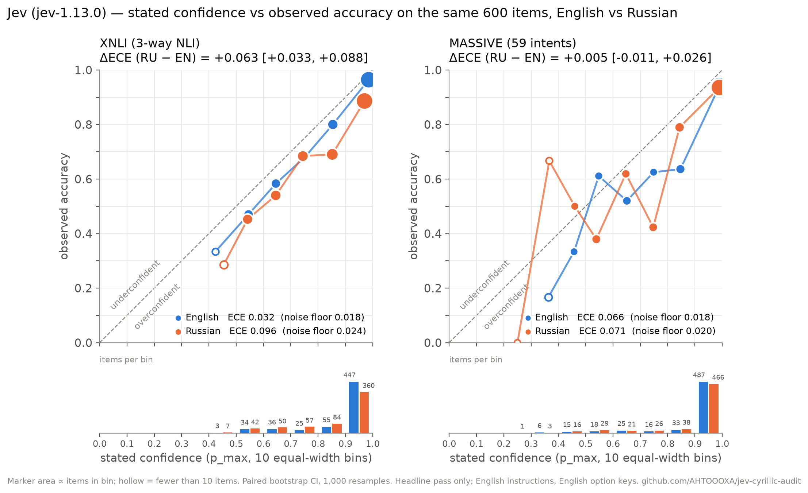
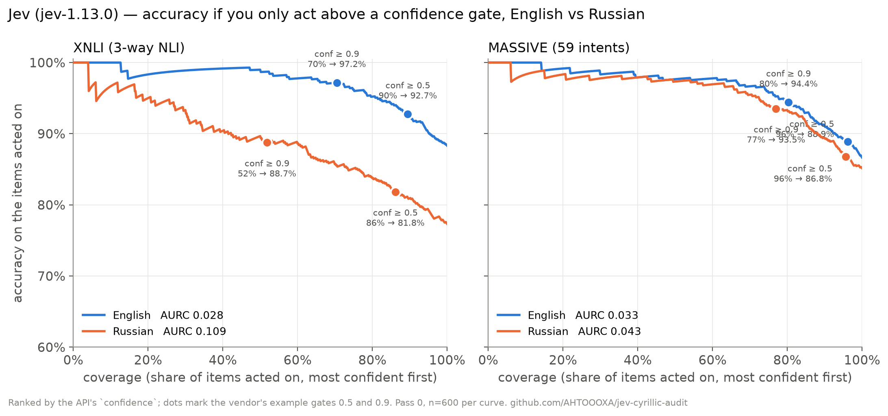
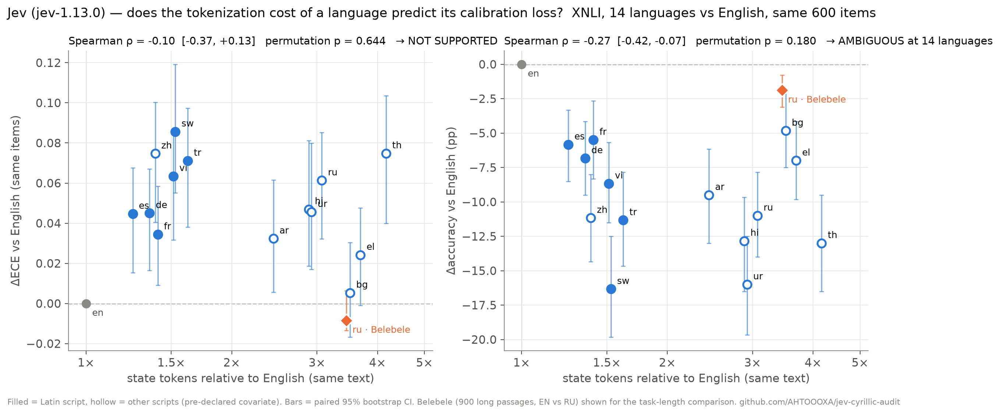
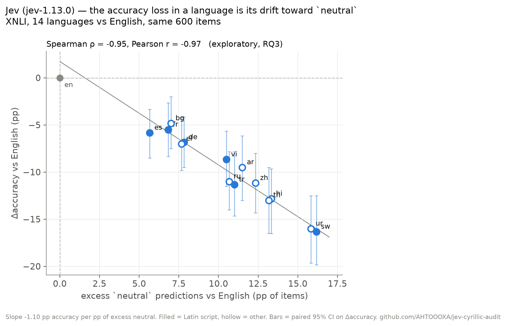

# jev-cyrillic-audit

> **Verdict (jev-1.13.0, n=600 paired items per dataset, pre-registered):** on XNLI, Jev is **measurably worse and less calibrated in Russian** — accuracy 88.3% → 77.3% (paired Δ = -11.0 pp, 95% CI [-14.2, -7.8]) and ECE 0.032 → 0.096 (Δ = +0.063 [+0.033, +0.088]); on MASSIVE intent classification there is **no detectable difference at n=600** — accuracy 86.7% vs 85.2% (Δ = -1.5 pp [-3.5, +0.2]), ECE 0.066 vs 0.071 (Δ = +0.005 [-0.011, +0.026]).



An independent, reproducible measurement of whether TypeSafe's Jev (`jev-1.13.0`) keeps its
**accuracy and calibration** on Russian vs English, on the *same human-labelled items*. The vendor
says non-English is "handled but not equally well" and gives no number
([docs](https://docs.typesafe.ai/models#language-support)); its own calibration claim is that
"outcomes assigned a probability of 0.8 should occur about 80% of the time"
([primer](https://docs.typesafe.ai/introduction/machine-learning-primer)). This repo tests exactly
that, in Russian, with the noise floor of the metric reported next to the metric.

Every number below regenerates from the committed raw responses with `make reproduce`.

## Results (headline pass, English instructions, English option keys)

## XNLI  (n=600 paired items, pass 0, jev-1.13.0)
| metric | EN | RU | RU − EN (paired 95% CI) |
|---|---|---|---|
| accuracy | 0.883 [0.858, 0.910] | 0.773 [0.743, 0.805] | **-11.0 pp** [-14.2, -7.8] |
| macro-F1 | 0.885 | 0.776 | -10.9 pp [-13.9, -7.7] |
| ECE (10 bins, p_max) | 0.032 [0.019, 0.056] | 0.096 [0.069, 0.126] | **+0.063** [+0.033, +0.088] |
| ECE noise floor / ratio | 0.018 / 1.74× | 0.024 / 4.06× | |
| mean p_max | 0.915 | 0.869 | |
| share p_max = 1.0 → accuracy there | 41.0% → 0.992 | 15.2% → 0.945 | |
| confidence ≥ 0.5: coverage → accuracy | 89.5% → 0.927 | 86.2% → 0.818 | |
| confidence ≥ 0.9: coverage → accuracy | 70.5% → 0.972 | 51.8% → 0.887 | |
| AURC on confidence (optimal / random) | 0.0279 (0.0071 / 0.1167) | 0.1094 (0.0279 / 0.2267) | |
| input tokens / call | 423 | 491 | ratio 1.162; state-only **3.07×** [3.01, 3.14] |
| discordance (exactly one arm correct) | | | 17.3%; same prediction in both arms 82.3% |

**Determinism (pass 0 vs pass 1, identical requests)**

| arm | flip rate | κ | mean \|Δp_max\| | max \|Δp_max\| | identical prob vectors | acc pass0 / pass1 |
|---|---|---|---|---|---|---|
| en | 1.50% | 0.977 | 0.0088 | 0.14 | 61.8% | 0.883 / 0.885 |
| ru | 1.67% | 0.973 | 0.0132 | 0.10 | 42.0% | 0.773 / 0.772 |

**Verdict (xnli):** accuracy — measurably worse on Russian; calibration — less calibrated on Russian.
confidence vs p_max: r=1.000/1.000, conf>p_max 0.0%/0.0%; choice≠argmax 2/0

## MASSIVE  (n=600 paired items, pass 0, jev-1.13.0)
| metric | EN | RU | RU − EN (paired 95% CI) |
|---|---|---|---|
| accuracy | 0.867 [0.840, 0.893] | 0.852 [0.823, 0.877] | **-1.5 pp** [-3.5, +0.2] |
| macro-F1 | 0.883 | 0.869 | -1.4 pp [-3.2, +2.0] |
| ECE (10 bins, p_max) | 0.066 [0.047, 0.091] | 0.071 [0.055, 0.099] | **+0.005** [-0.011, +0.026] |
| ECE noise floor / ratio | 0.018 / 3.73× | 0.020 / 3.61× | |
| mean p_max | 0.929 | 0.918 | |
| share p_max = 1.0 → accuracy there | 59.2% → 0.972 | 55.7% → 0.973 | |
| confidence ≥ 0.5: coverage → accuracy | 96.2% → 0.889 | 95.7% → 0.868 | |
| confidence ≥ 0.9: coverage → accuracy | 80.3% → 0.944 | 77.0% → 0.935 | |
| AURC on confidence (optimal / random) | 0.0325 (0.0093 / 0.1333) | 0.0426 (0.0116 / 0.1483) | |
| input tokens / call | 1460 | 1476 | ratio 1.010; state-only **3.37×** [3.26, 3.48] |
| discordance (exactly one arm correct) | | | 5.2%; same prediction in both arms 92.5% |

**Determinism (pass 0 vs pass 1, identical requests)**

| arm | flip rate | κ | mean \|Δp_max\| | max \|Δp_max\| | identical prob vectors | acc pass0 / pass1 |
|---|---|---|---|---|---|---|
| en | 0.50% | 0.995 | 0.0081 | 0.14 | 70.0% | 0.867 / 0.865 |
| ru | 2.17% | 0.978 | 0.0086 | 0.14 | 62.5% | 0.852 / 0.855 |

**Verdict (massive):** accuracy — no detectable accuracy difference at n=600; calibration — no detectable calibration difference at n=600.
confidence vs p_max: r=1.000/1.000, conf>p_max 0.2%/0.2%; choice≠argmax 0/1

Reading the XNLI row of the reliability diagram: in the top bin (`p_max ≥ 0.9`, 360 Russian items) Jev states
0.97 on average and is right 88.6% of the time; in English the same bin states 0.985 and is right 96.4%.
The Russian accuracy loss is concentrated on `entailment` (recall 0.85 → 0.64): in Russian the model
drifts toward `neutral` (303 vs 236 predictions), i.e. it hedges more and is still overconfident when it does.



**Other measurements (exploratory, pre-registered as such):**

- **Gating on the vendor's example thresholds.** XNLI at `confidence ≥ 0.9`: English acts on 70% of items at 97.2% accuracy, Russian on 52% at 88.7%. MASSIVE: 80% → 94.4% vs 77% → 93.5%.
- **Russian costs ~3× the tokens for the same text.** State-only input tokens RU/EN: **3.07×** (XNLI) and **3.37×** (MASSIVE). Per call the ratio is diluted by the fixed question text (1.16× / 1.01×). Latency is identical (p50 ≈ 320–340 ms).
- **Run-to-run stability is high.** Identical requests flip the label on 0.5–2.2% of items (κ ≥ 0.97), |Δp_max| ≤ 0.14; accuracy moves ≤ 0.3 pp between passes, so the RU−EN deltas are not jitter. The API does **not** cache identical requests (probability vectors differ on 30–58% of repeated calls).
- **`confidence` is a function of `p_max`.** Across all 4,800 responses `confidence` matches `(k·p_max − 1)/(k − 1)` (k = number of options) to within the API's 2-decimal rounding (max residual 0.02, r = 1.000). Calibration is therefore computed on `p_max`, which is comparable with the literature; ranking by `confidence` and by `p_max` is the same ranking within a dataset.
- **Ties.** 7 of 4,800 responses have `choice` ≠ argmax of the returned probabilities — all are exact 2-decimal ties (0.50/0.50). The API breaks ties on unrounded values; we use the argmax and report the count.
- **Probabilities are returned rounded to 2 decimals.** Bin edges are therefore stated explicitly (left-closed, exact decimal edges, top bin closed); ECE is cross-checked against `netcal` to 1e-9 in the tests.

## Study 2 — Panorama (2026-09-21): 14 languages, one pre-registered hypothesis, one surprise

**Pre-registered question ([PREREG-2.md](PREREG-2.md)):** does a language's *tokenization cost* — a label-free number anyone can compute — predict Jev's calibration loss? Same 600 XNLI items in all 15 languages, Belebele en/ru (900 long passages) as a task-length control; 21,600 calls, 0 errors, $0.45.

**Answer: no.** Spearman ρ(token ratio, ΔECE) = -0.10 (permutation p = 0.64, item-bootstrap CI [-0.37, +0.13]) → **NOT SUPPORTED**. Bulgarian costs 3.5× the tokens and loses almost nothing (Δacc -4.8 pp, ΔECE +0.005); Swahili costs 1.5× and is the worst language (-16.3 pp, +0.086). Script does not explain it either (Latin-script mean ΔECE +0.057 vs other scripts +0.046). Token cost is a cost, not a proxy for quality.



**What the panorama does show:**

- **Every one of the 14 languages is measurably worse than English on XNLI** — all 14 Δacc CIs exclude 0, from Spanish/French/German (−5.5 to −6.8 pp) to Urdu/Swahili (−16 pp); 12 of 14 ΔECE CIs exclude 0 (Bulgarian and Greek do not). Russian sits mid-pack (-11.0 pp, +0.061).
- **The loss is not about length.** Belebele (reading comprehension over a full passage, RU costs 3.45× the tokens) loses only -1.9 pp [-3.1, -0.8] at 95–97 % accuracy, and Russian is if anything *better* calibrated there (ΔECE -0.008 [-0.013, +0.006]). Together with MASSIVE (Study 1) that is two selection tasks with no loss and one inference task with a large one.
- **The surprise (exploratory RQ3, not a pre-registered test):** across the 14 languages the accuracy loss is almost entirely the model's drift toward `neutral`: Spearman ρ(excess-neutral share, Δacc) = -0.95, Pearson -0.97, slope ≈ −1.1 pp of accuracy per pp of excess neutral. A model that lost accuracy by confusing entailment with contradiction would not produce this line. On the drifted items (EN correct and non-neutral, other language says `neutral`; n = 964) the mean stated confidence is 0.74 — partly honest hedging — but 21 % are stated at ≥ 0.9, and 61 % of them are gold `entailment`: outside English, Jev under-recognises that a premise *supports* a hypothesis and retreats to "undetermined".



- **Replication across days.** The English and Russian arms were re-run in this session (not reused from Study 1): accuracy 0.883 → 0.882 (EN) and 0.773 → 0.772 (RU), ECE 0.032 → 0.036 and 0.096 → 0.097, label agreement across days 99.2 % / 98.7 %.

**Next pre-registered step (not run):** the neutral-drift mechanism is an exploratory finding on the same items it was noticed on. Study 3 would test it as the primary hypothesis on 600 *fresh* XNLI items (validation split), and on a 3-way task without an "undetermined" option, for ≈ $0.35.

<details><summary>Study 2 tables (generated by <code>make reproduce2</code>)</summary>

## Study 2 — Panorama (XNLI × 15 languages, same 600 items; pass 0; jev-1.13.0)

English reference: accuracy 0.882, ECE 0.036 (floor 0.018).

| lang | script | n | tokens ×EN | accuracy | Δacc vs EN (95% CI) | ECE (floor) | ΔECE vs EN (95% CI) | excess neutral | flip rate |
|---|---|---|---|---|---|---|---|---|---|
| es | latin | 600 | 1.25 | 0.823 | -5.8 [-8.5, -3.3] | 0.080 (0.020) | +0.045 [+0.015, +0.068] | +5.7 pp | 1.0% |
| de | latin | 600 | 1.35 | 0.813 | -6.8 [-9.5, -4.2] | 0.081 (0.022) | +0.045 [+0.016, +0.067] | +7.8 pp | 0.8% |
| zh | non-latin | 600 | 1.39 | 0.770 | -11.2 [-14.3, -8.0] | 0.110 (0.023) | +0.075 [+0.040, +0.100] | +12.3 pp | 1.2% |
| fr | latin | 600 | 1.41 | 0.827 | -5.5 [-8.3, -2.7] | 0.070 (0.021) | +0.034 [+0.009, +0.059] | +6.8 pp | 1.3% |
| vi | latin | 600 | 1.51 | 0.795 | -8.7 [-11.5, -5.7] | 0.099 (0.022) | +0.063 [+0.032, +0.086] | +10.5 pp | 1.0% |
| sw | latin | 600 | 1.53 | 0.718 | -16.3 [-19.8, -12.5] | 0.121 (0.026) | +0.086 [+0.055, +0.119] | +16.2 pp | 1.7% |
| tr | latin | 600 | 1.62 | 0.768 | -11.3 [-14.7, -7.8] | 0.107 (0.023) | +0.071 [+0.038, +0.097] | +11.0 pp | 1.5% |
| ar | non-latin | 600 | 2.44 | 0.787 | -9.5 [-13.0, -6.2] | 0.068 (0.026) | +0.032 [+0.006, +0.062] | +11.5 pp | 1.3% |
| hi | non-latin | 600 | 2.88 | 0.753 | -12.8 [-16.5, -9.7] | 0.083 (0.027) | +0.047 [+0.019, +0.081] | +13.3 pp | 2.3% |
| ur | non-latin | 600 | 2.92 | 0.722 | -16.0 [-19.7, -12.5] | 0.081 (0.030) | +0.046 [+0.017, +0.080] | +15.8 pp | 2.0% |
| ru | non-latin | 600 | 3.07 | 0.772 | -11.0 [-14.0, -7.8] | 0.097 (0.024) | +0.061 [+0.032, +0.085] | +10.7 pp | 1.0% |
| bg | non-latin | 600 | 3.51 | 0.833 | -4.8 [-7.5, -2.0] | 0.041 (0.024) | +0.005 [-0.017, +0.030] | +7.0 pp | 1.3% |
| el | non-latin | 600 | 3.69 | 0.812 | -7.0 [-9.8, -4.2] | 0.060 (0.023) | +0.024 [-0.001, +0.048] | +7.7 pp | 0.8% |
| th | non-latin | 600 | 4.17 | 0.752 | -13.0 [-16.5, -9.5] | 0.111 (0.025) | +0.075 [+0.040, +0.104] | +13.2 pp | 1.0% |

**RQ1 (primary):** Spearman ρ(token ratio, ΔECE) = **-0.10**, one-sided permutation p = 0.644, item-bootstrap 95% CI [-0.37, +0.13] (n = 600 common items) → **NOT SUPPORTED**
**RQ2:** ρ(token ratio, Δacc) = **-0.27**, p = 0.180, CI [-0.42, -0.07] → **AMBIGUOUS at 14 languages**
**RQ3:** ρ(excess neutral, Δacc) = -0.95 (Pearson -0.97)
**Script (exploratory):** mean ΔECE Latin +0.057 (ratio 1.45×) vs non-Latin +0.046 (ratio 3.01×); ρ within non-Latin -0.10

## Belebele (reading comprehension, 4-way MC), EN vs RU, n=900 paired

| metric | EN | RU | RU − EN (paired 95% CI) |
|---|---|---|---|
| accuracy | 0.970 | 0.951 | **-1.9 pp** [-3.1, -0.8] |
| ECE (floor) | 0.017 (0.007) | 0.008 (0.011) | **-0.008** [-0.013, +0.006] |
| state tokens ×EN | | | 3.45 [3.41, 3.48] |
| flip rate | 0.1% | 0.3% | |

</details>

## Method

- **Design.** Two factors would make a 2×2 (state language × instruction language); this run is the clean pair **A = English state vs B = Russian state, English instructions in both**, on the same items. One item per call, one `Choice` question per call, option keys English in both arms (`entailment`, `alarm_set`, …). Two passes per cell; the headline uses pass 0, pass 1 is the stability check.
- **Data** (pinned HF revisions in `PREREG.md`): XNLI `facebook/xnli` en/ru test (5,010 human-translated pairs; 2 rows with swapped hypotheses in the `ru` file excluded before sampling) and MASSIVE intent `mteb/amazon_massive_intent` en/ru test (2,974 utterances, 59 intents). 600 items per dataset, stratified by gold label, `seed=20260919`, frozen in `data/items.parquet` (ids and hashes only — **no source text is redistributed**).
- **Prompts** (`prompts/*.json`, SHA-256 frozen before the run) follow the vendor's docs: state as a JSON object, fields referenced by backticked key in the instructions, a one-line English gloss per MASSIVE intent.
- **Protocol.** `PREREG.md` + hashes committed before the first non-dry run; `response.model` asserted on every call; concurrency 8 under a 1,150 rpm pacer; every response logged as a derived row (`item_id, gold, pred, p_max, confidence, probs, input_tokens, latency_ms, model, request_id, ts`). 4,800 calls, 0 errors, 4.6M input tokens, **$0.19**, 4 min 15 s.
- **Metrics** (`src/jev_cyrillic_audit/metrics.py`, numpy only, 11 synthetic tests): accuracy, macro-F1, ECE (10 equal-width bins on `p_max`) with its **simulated noise floor** (1,000 draws under perfect calibration on the arm's own confidence vector) and the ratio, reliability bins, selective accuracy / AURC, percentile bootstrap CIs (1,000 resamples), and **paired** RU−EN deltas that resample item indices once and recompute both arms — never "the two CIs overlap".
- **Decision rule** (written before the run, applied in order): stability gate (run-to-run jitter must be smaller than the delta) → accuracy: CI excludes 0 and |Δ| ≥ 3 pp → "measurably worse/better"; CI includes 0 with half-width ≤ 3 pp → "no detectable difference"; else AMBIGUOUS → calibration measurable only if ECE/floor ≥ 1.5 in both arms → ΔECE: CI excludes 0 and |Δ| ≥ 0.02 → "less/more calibrated"; CI includes 0 → "no detectable difference"; else AMBIGUOUS.

## Limitations

- One prompt wording per dataset (a sample of size 1 from wording space). Option keys and MASSIVE glosses are English in the Russian arm — a deliberate control that also means the Russian cell is not a fully-Russian deployment. The RU-instruction cells (C/D) are frozen in `prompts/*.ru.json` but not run here.
- XNLI labels were annotated on the English text and copied to the translations; ~15% of XNLI items are ambiguous even to humans. That ceiling applies to both arms equally, which is why the comparison is paired.
- n=600 resolves ±3 pp on the paired accuracy delta and a ratio-2 calibration effect; the MASSIVE result is "not detected at this n", not "equal". ECE bins below 0.9 hold 1–84 items (counts printed under the chart).
- Black-box API: results are for `jev-1.13.0` on 2026-09-20; the raw responses are committed so the numbers survive model updates even if the API does not.
- Two datasets, one model, no baseline system. Baselines (fine-tuned `xlm-roberta`, a zero-shot LLM with log-probs) are follow-up work, not part of this measurement.

## Reproduce

```
uv sync
make check-prereg      # PREREG.md and prompts/ match their committed hashes
make test              # 24 tests: metrics on synthetic data (incl. netcal cross-check), runner on a fake API
make reproduce         # Study 1: runs/*.jsonl -> results.json/.md; Study 2: runs/study2/ -> results2.json/.md; figures/*.png (deterministic)
```

To re-run the measurement itself (needs `TYPESAFE_API_KEY` in `.env`; ~$0.20):
`uv run python -m jev_cyrillic_audit.run --run-id <new-id>`. The runner refuses to write to `runs/`
unless the freeze verifies and the frozen files are clean in git. Building a new sample:
`uv run python -m jev_cyrillic_audit.data`.

## Layout

```
PREREG.md, PREREG-2.md         frozen before each study's run (hashes in PREREG.sha256); decision rules inside
prompts/*.json, prompts.sha256 instructions + criteria per dataset × instruction language
data/items.parquet             item ids, gold, state hashes — no text; data/question_overhead.json
runs/<run_id>-*.jsonl          Study 1 raw rows; runs/study2/ Study 2 raw rows; manifest.json in each
results*.json, results*.md     every number in this README, regenerated by `make reproduce`
figures/                       reliability_paired.png, selective_accuracy.png
src/jev_cyrillic_audit/        data.py · questions.py · run.py · metrics.py · analyse.py · panorama.py · figures.py
tests/                         synthetic metric tests, fake-API runner tests
```

## Credits and license

Method conventions (pinned revisions, per-example artefacts, paired bootstrap) follow
[AbdelStark/jev-benchmarks](https://github.com/AbdelStark/jev-benchmarks) (Apache-2.0); see `THIRD_PARTY.md`.
ECE noise-floor framing after Guo et al. 2017 and the `netcal` reference implementation.

MIT for the code and the derived rows in this repository. Datasets keep their own licenses
(MASSIVE: Apache-2.0 on the mirror / CC BY 4.0 upstream; XNLI: no license tag on the HF card) — only
our own measurements are redistributed, re-join on `item_id` to recover the text.
